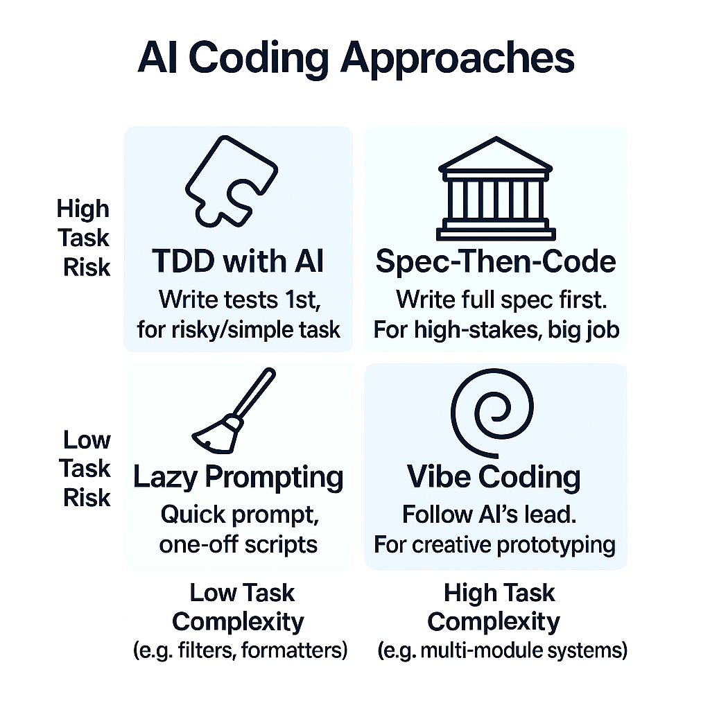

# spec-then-code
LLM prompts for structured software development because quality takes more than just "good vibes".

## Overview

Spec-Then-Code is a methodology for structured software development using Large Language Models (LLMs) designed for situations where quality cannot be compromised. While [vibe coding](https://x.com/karpathy/status/1886192184808149383) (popularized by Andrej Karpathy in February 2025) works well for prototypes, demos, and visual features that can be verified by eye, it falls short when dealing with critical technical problems or complex systems. As Simon Willison [notes](https://simonwillison.net/2025/Mar/19/vibe-coding/), for vibe coding, "Projects should be low stakes." Spec-Then-Code bakes verification directly into the development process, providing a structured approach for high-stakes features and bug fixes where deep understanding of the implementation is essential. The result is more reliable software with clearer requirements, better architecture, and code that developers can confidently maintain in mission-critical environments. This repository provides prompts designed to guide LLMs through implementing all these principles automatically.

## Choosing the Right Approach

Not all AI-assisted development is the same. The right approach depends on both the complexity of the task and the risk associated with getting it wrong:

### Risk vs. Complexity Framework

- **Low Complexity / Low Risk → Lazy Prompting**  
  For simple, low-stakes tasks, a quick prompt is often sufficient. Think debugging help, small utility functions, or code formatting.

- **High Complexity / Low Risk → Vibe Coding**  
  When building prototypes or exploratory features, letting AI generate code with minimal guidance can accelerate development. Perfect for creative exploration when correctness isn't critical.

- **Low Complexity / High Risk → TDD with AI**  
  For simple but critical components, test-driven development with AI provides a good balance. Have the AI write tests first, then implement the solution that passes those tests.

- **High Complexity / High Risk → Spec-Then-Code**  
  Complex, high-stakes features demand the most rigorous approach. A detailed specification ensures all requirements, verification criteria, and edge cases are considered before implementation begins.

## When to Use Spec-Then-Code

If it's not a low-risk prototype and the amount of work is more than what you would do in one commit, it's probably worth employing Spec-Then-Code. This approach is especially valuable for mission-critical features where quality cannot be compromised and for changes that span multiple components or development sessions.

## Verification and Definition of "Done"

A cornerstone of Spec-Then-Code is how it establishes clear completion criteria:

- **Evidence over Assertions** — Never accept "task completed" at face value. Require concrete evidence like passing tests, working features, or runtime demonstrations.

- **Clear Definition of Done** — Each task should have explicit verification criteria that unambiguously define when it's truly complete.

- **Completeness Checks** — Verify that all components affected by a change have been properly updated, not just the most visible parts.

By defining "done" with precision, Spec-Then-Code prevents the common pitfall where AIs mark tasks complete while missing critical dependencies or edge cases.

### Multi-AI Cross-Validation

A helpful enhancement to the verification process is using multiple AI models to cross-validate each other's work:

- **Complementary Strengths** — Different AI models may excel in different areas or have varied approaches to problem-solving.

- **Catching Oversights** — Having one AI review another's implementation plan can identify missing dependencies or edge cases.

- **Improved Confidence** — When multiple independent AI systems arrive at similar solutions, it increases confidence in the approach.

This technique is particularly valuable for critical components where thoroughness is essential.

### Recursive Planning Technique

When dealing with particularly complex tasks, a single level of planning may be insufficient. The recursive planning technique involves treating complex implementation steps as "mini-projects" with their own detailed plans:

- **Plan-Within-A-Plan** — Break down complex implementation steps into their own detailed, structured plans before writing any code.

- **On-Demand Decomposition** — Recognize when a task is too large or intricate for a single prompt and pause to create a sub-plan.

- **Contextual Focus** — Each mini-plan maintains the context of the larger goal while allowing focused attention on specific implementation details.

- **Test-First Mini-Iterations** — Start each sub-task with a failing test that defines the expected behavior, following Uncle Bob Martin's Clean Code principles and Test-Driven Development methodology.

As Armando Maynez describes in his article "From 'Vibe Coding' to 'Vibe Software Engineering'" (https://substack.com/inbox/post/162152910):

> "I realized that if a task felt too large or intricate for a single prompt, it probably was. The solution? When faced with such a task, I learned to pause the coding and first ask Cursor itself to create a detailed, step-by-step implementation plan for that specific task. Essentially, I was applying my planning methodology recursively."

> "By breaking down the complex task into a mini-project with its own checklist within the main chat window, I could guide Cursor through smaller, more manageable steps, leading to much more reliable results. Recognizing when to double-click and create these sub-plans became a crucial skill, honed by experience and the occasional Cursor mishap."

This recursive approach, when combined with Test-Driven Development principles, creates a powerful workflow: each mini-plan's steps begin with tests that fail until properly implemented. This "red-green-refactor" cycle applied at the micro-level ensures that even the smallest components meet their specifications before being integrated. As Uncle Bob Martin emphasizes, letting tests drive development leads to more modular, maintainable code with built-in verification — a perfect complement to detailed planning.

The combined approach significantly improves reliability when implementing complex features and helps maintain focus throughout the development process while ensuring correctness at every step.

## Context Window Management

A key benefit of Spec-Then-Code is how it manages the limited context windows of both humans and AI:

- **External Persistent Memory** — The specification document serves as a shared knowledge base that persists across multiple development sessions. When you return to a project days later or switch AI tools, you don't need to rebuild context from scratch.

- **Focus on What Matters** — By systematically capturing requirements, code snippets, and verification criteria in a structured document, both you and the AI can focus on implementation without losing sight of the bigger picture.

- **Session Continuity** — When working on complex projects that exceed a single AI session's capacity, the spec provides continuity. You can reference specific sections when asking the AI to implement particular components.

- **Reduced Cognitive Load** — Humans have limited working memory too. The spec offloads the mental burden of tracking all details, allowing you to focus on higher-level direction and quality control.

This approach transforms potentially fragmented AI interactions into a cohesive development process for complex projects that would otherwise exceed context limitations.

## Beyond Code: Extensions to Marketing and Branding

While Spec-Then-Code primarily focuses on structured software development, the same principles can be extended to non-code aspects of product development:

- **Brand Identity Development** — Using structured prompts to generate tone of voice guides and visual style specifications
- **Marketing Material Generation** — Applying specification-driven approaches to create consistent marketing assets
- **Cross-Discipline Integration** — Instructing AI tools to follow brand guidelines when generating user-facing content in applications

These extensions fall outside the primary scope of what Spec-Then-Code currently aims to facilitate, but practitioners interested in exploring these areas may find value in the following resources:

- Kevin Leneway's interview (https://www.youtube.com/watch?v=CIAu6WeckQ0) provides additional perspectives on extending structured AI approaches across the product lifecycle
- Armando Maynez's article "From 'Vibe Coding' to 'Vibe Software Engineering'" (https://substack.com/inbox/post/162152910) offers insights on integrating branding elements directly into the development process

## What These Prompts Do

The templates in this repository are designed to automate the Spec-Then-Code approach by:

- **Guiding Specification Creation** — The specification template provides a structured format that ensures all critical aspects are documented, from problem statement to verification criteria.

- **Enforcing Test-First Development** — The implementation guide instructs LLMs to write tests before code, automatically building verification into the process.

- **Automating Completeness Checks** — Prompts instruct the AI to verify all affected components are updated before marking tasks complete.

- **Maintaining Traceability** — The workflow keeps a clear connection between requirements, verification criteria, and implementation steps.

Rather than having to manually guide the AI through each of these practices, these prompts automate the entire workflow, allowing you to focus on the quality of the solution.

## Using in Your IDE

Want to use these prompts in Cursor, Windsurf, or other AI-powered IDEs without copying and pasting? Here's how to do it through the magic of GitMCP:

1. **Connect to this prompt library**
   - Visit [gitmcp.io](https://gitmcp.io/)
   - Enter this repository URL: `https://github.com/mosofsky/spec-then-code`
   - Click "To MCP"
   - This creates a special link that your AI assistant can use to access these prompts

2. **Add to your AI assistant**
   - Follow the simple connection instructions provided on the page
   - Once connected, you can access these prompts directly in your IDE
   - Just use the `stc` prefix (e.g., `stc create a login system`)

